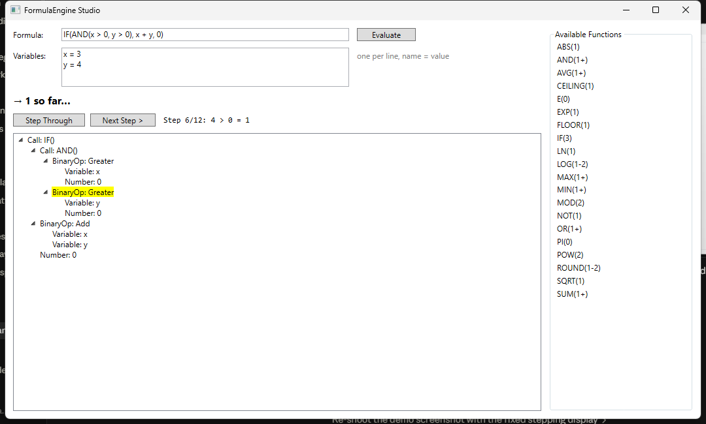

# FormulaEngine


A formula/expression calculation engine, written in C#, with a WPF desktop
IDE for interactively evaluating expressions, inspecting how they parse, and
stepping through evaluation one node at a time.

Mirrors the shape of a real "calculation engine + desktop client" product:
a standalone, dependency-free interpreter core, and a thin UI shell built on
top of it.



*Stepping through `IF(AND(x > 0, y > 0), x + y, 0)` — the highlighted node in
the AST tree is the one the "Step 6/12" line describes, and the result line
shows the value computed so far.*

## Structure

- **`FormulaEngine.Core`** — the interpreter. Tokenizer → recursive-descent
  parser → AST → tree-walking evaluator, no UI dependencies.
  - `Lexing/` — `Lexer`, `Token`, `TokenType`
  - `Ast/` — one node class per grammar production (`NumberNode`,
    `VariableNode`, `UnaryOpNode`, `BinaryOpNode`, `FunctionCallNode`),
    dispatched through `IAstVisitor<T>` (interpreter/visitor pattern)
  - `Parsing/` — `Parser`, a standard precedence-climbing recursive descent
    parser: comparison (`= <> < <= > >=`) < `+ -` < `* /` < unary `-` < `^`
    (with `^` right-associative)
  - `Evaluation/` — `Evaluator` (an `IAstVisitor<double>`), `EvaluationContext`
    (variables + function registry), and `EvaluationStep` — the evaluator can
    optionally record one step per node, in the order it's actually
    evaluated, which is what drives the Studio's step-through debugger
  - `Functions/` — `IFunction` is the extension point: new functions are
    registered with `FunctionRegistry` without touching the parser or
    evaluator. Ships with:
    `SUM AVG MIN MAX ABS SQRT POW ROUND IF AND OR NOT LN LOG EXP MOD CEILING FLOOR PI E`
  - `Formula` — the public facade: `Formula.Parse(expr)`,
    `Formula.Evaluate(expr, context)`, `Formula.EvaluateWithTrace(expr, context)`

- **`FormulaEngine.Studio`** — WPF desktop shell.
  - Formula input, a variables panel, and an **Evaluate** button for a
    straight result
  - **Step Through** / **Next Step** buttons walk the evaluation one node at
    a time, highlighting the current node in the live AST `TreeView` and
    showing the running value
  - On a parse error, the offending text is selected in the formula box and
    its border turns red, using the exact character position the lexer/parser
    reported — not just an error message
  - A side panel lists every registered function and its arity, read
    straight from `FunctionRegistry` — new functions show up automatically
  - The tree view is built by `AstTreeBuilder`, which implements the same
    `IAstVisitor<T>` interface as the evaluator — one dispatch mechanism,
    two independent consumers (compute a value vs. render a tree)

- **`FormulaEngine.Tests`** — xUnit tests (70+) covering lexer edge cases and
  exact error positions, parser precedence/associativity for every operator,
  evaluator correctness and errors (divide by zero, undefined variable,
  unknown function, arg-count mismatch), the evaluation trace, and the
  plugin extensibility path.

## Design decisions

**Visitor/interpreter pattern for the AST.** Each node type
(`NumberNode`, `BinaryOpNode`, ...) implements `Accept<T>(IAstVisitor<T>)`
instead of carrying an `Evaluate()` method itself. That keeps the node
classes as pure data and lets new operations — evaluation, the tree-view
renderer, the step trace — be added as new `IAstVisitor<T>` implementations
without ever touching the node types again. `Evaluator` and the Studio's
`AstTreeBuilder` are two independent visitors over the exact same tree.

**Plugin functions over a switch statement.** `IFunction` + `FunctionRegistry`
mean the evaluator has no idea `SUM` or `IF` exist — it only knows how to
look a name up and call it. Adding `LOG` or a user's own function is a new
class, not an edit to the evaluator (open/closed principle).

**Recursive descent over a parser generator.** For a grammar this size, a
hand-written precedence-climbing parser is more transparent than pulling in
a generator — the precedence table (`comparison < + - < * / < unary - < ^`)
maps directly onto the chain of `ParseX` methods, each one call away from
the level tighter than it.

## Building

Requires the [.NET 8 SDK](https://dotnet.microsoft.com/download/dotnet/8.0).

```bash
dotnet build
dotnet test
dotnet run --project src/FormulaEngine.Studio
```

### Running without the SDK installed

Publish a self-contained executable (no separate .NET install needed to run it):

```bash
dotnet publish src/FormulaEngine.Studio -c Release -r win-x64 --self-contained true -p:PublishSingleFile=true
```

The output lands under `src/FormulaEngine.Studio/bin/Release/net8.0-windows/win-x64/publish/`.

## Example

```csharp
using FormulaEngine.Core;
using FormulaEngine.Core.Evaluation;

var context = new EvaluationContext(new Dictionary<string, double> { ["x"] = 3, ["y"] = 4 });
double result = Formula.Evaluate("SUM(1, 2, x) * (y - 1) ^ 2", context); // 54
```

Stepping through an evaluation:

```csharp
var (result, ast, steps) = Formula.EvaluateWithTrace("IF(x > 5, 1, 0)", context);
foreach (var step in steps)
    Console.WriteLine(step.Description); // e.g. "x = 3", "3 > 5 = 0", "0"
```

Adding a function requires no changes to the core:

```csharp
public sealed class DoubleFunction : IFunction
{
    public string Name => "DOUBLEIT";
    public int MinArgs => 1;
    public int MaxArgs => 1;
    public double Invoke(IReadOnlyList<double> args) => args[0] * 2;
}

var registry = FunctionRegistry.CreateDefault();
registry.Register(new DoubleFunction());
```

## License

[MIT](LICENSE)
